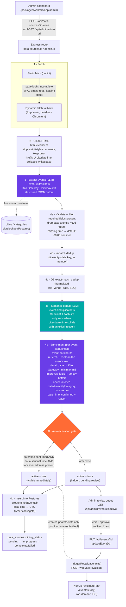

## Diagram

```mermaid
flowchart TD
    Admin["Admin dashboard\n(packages/web/src/app/admin)"] -->|"POST /api/data-sources/:id/mine\nor POST /api/admin/mine-url"| Route["Express route\ndata-sources.ts / admin.ts"]

    Route --> Fetch

    subgraph Fetch["1 · Fetch"]
        direction TB
        F1["Static fetch (undici)"] -->|"page looks incomplete\n(SPA / empty root / loading state)"| F2["Dynamic fetch fallback\n(Puppeteer, headless Chromium)"]
    end

    Fetch --> Clean["2 · Clean HTML\nhtml-cleaner.ts\nstrip script/style/comments,\nkeep only href/src/role/datetime,\ncollapse whitespace"]

    Clean --> Extract["3 · Extract events (LLM)\nevent-extractor.ts\nKilo Gateway · minimax-m3\nstructured JSON output"]

    Extract -.->|"live enum constraint"| Slugs[("cities / categories\nslug lookup (Postgres)")]

    Extract --> Validate["4a · Validate + filter\nrequired fields present\ndrop past events / >60d future\nmissing time → default 08:00 sentinel"]

    Validate --> Dedup1["4b · In-batch dedup\n(title+city+date key, in memory)"]

    Dedup1 --> Dedup2["4c · DB exact-match dedup\n(normalized title+venue+date, SQL)"]

    Dedup2 --> Dedup3["4d · Semantic dedup (LLM)\nevent-deduplicator.ts\nGemini 3.1 flash-lite\nonly runs when city+date+time collide\nwith an existing event"]

    Dedup3 --> Enrich["4e · Enrichment (per event, sequential)\nevent-enricher.ts\nre-fetch + re-clean the event's own\ndetail page → Kilo Gateway · minimax-m3\nimproves fields IF strictly better;\nnever touches date/time/city/category;\nmust return date_time_confirmed + reason"]

    Enrich --> Gate{"4f · Auto-activation gate"}
    Gate -->|"date/time confirmed AND\nnot a sentinel time AND\nlocation+address present"| Active["active = true\n(visible immediately)"]
    Gate -->|"otherwise"| Inactive["active = false\n(hidden, pending review)"]

    Active --> Insert["4g · Insert into Postgres\ncreateMinedEventDb\nlocal time → UTC (America/Bogota)"]
    Inactive --> Insert

    Insert --> Status["data_sources.mining_status\npending → in_progress → completed/failed"]

    Inactive --> Review["Admin review queue\nGET /api/admin/events/inactive"]
    Review -->|"edit + approve\n(active: true)"| Update["PUT /api/events/:id\nupdateEventDb"]
    Active -.->|"create/update/delete only\n(not the mine route itself)"| Revalidate
    Update --> Revalidate["triggerRevalidation(city)\nPOST web /api/revalidate"]
    Revalidate --> ISR["Next.js revalidatePath\n/eventos/{city}\n(on-demand ISR)"]

    style Extract fill:#6A3DE8,color:#fff
    style Dedup3 fill:#00A9A5,color:#fff
    style Enrich fill:#6A3DE8,color:#fff
    style Gate fill:#FF6B35,color:#fff
```
